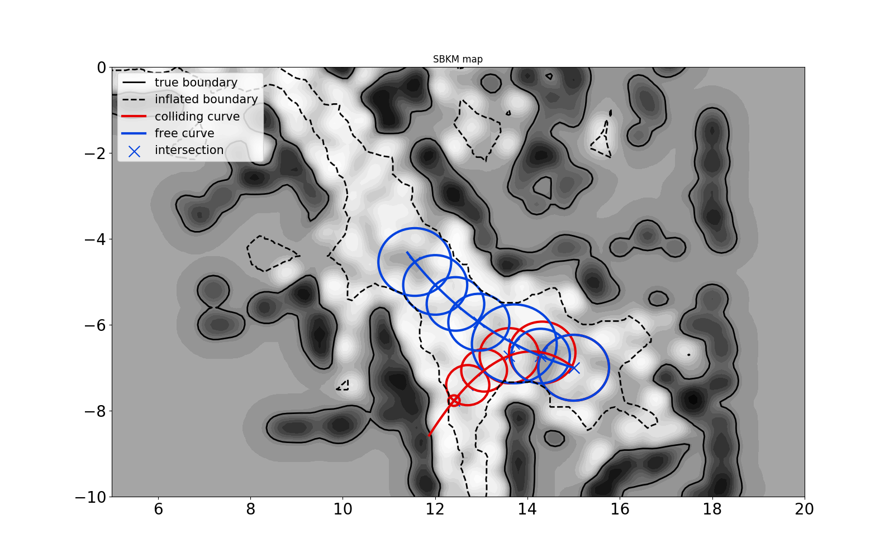

# Sparse Bayesian Kernel-based Mapping (SBKM)
This repo provides code for our paper "Autonomous Navigation in Unknown Environments with Sparse Bayesian Kernel-based Occupancy Mapping".
Please check out our project website for more details: https://thaipduong.github.io/sbkm.

## Dependencies
Our code depends on the following Python packages: numpy, scipy, panda, rtree, matplotlib, sklearn.
Tested with Ubuntu 18.04 and Python 3.7.
## Demo
Run ```python sbkm_demo.py``` for a demo with Intel Research Lab dataset


Run ```python collision_checking_demo.py``` for a demo of our collision checking methods for line segments (top) and curves (bottom).
<p float="left">


</p>


## Citation
If you find our papers/code useful for your research, please cite our work as follows.

1. T. Duong, M. Yip, N. Atanasov. [Autonomous Navigation in Unknown Environments with Sparse __*Bayesian*__ Kernel-based Occupancy Mapping](https://thaipduong.github.io/sbkm/). In Submission. 2020

 ```bibtex
@article{duong2020autonomousbayesian,
  title={Autonomous Navigation in Unknown Environments with Sparse Bayesian Kernel-based Occupancy Mapping},
  author={Duong, Thai and Yip, Michael and Atanasov, Nikolay},
  url = {https://thaipduong.github.io/sbkm},
  journal={In Submission},
  year={2020}
 }
```
2.  T. Duong, N. Das, M. Yip, N. Atanasov. [Autonomous Navigation in Unknown Environments using Sparse Kernel-based Occupancy Mapping](https://thaipduong.github.io/kernelbasedmap/). IEEE International Conference on Robotics and Automation (ICRA), 2020.
 
 ```bibtex
@inproceedings{duong2020autonomous,
  title={Autonomous Navigation in Unknown Environments using Sparse Kernel-based Occupancy Mapping},
  author={Duong, Thai and Das, Nikhil and Yip, Michael and Atanasov, Nikolay},
   booktitle={IEEE International Conference on Robotics and Automation (ICRA)},
   year={2020},
   url = {https://thaipduong.github.io/kernelbasedmap},
   pdf = {https://arxiv.org/pdf/2002.01921.pdf}
 }
```
## Acknowledgement
Our code was built on top of the original fast Relevance Vector Machine training (https://github.com/AmazaspShumik/sklearn-bayes) and the Intel Research lab dataset was borrowed from Sparse Bayesian Hilbert Map code (https://github.com/RansML/Bayesian_Hilbert_Maps)
